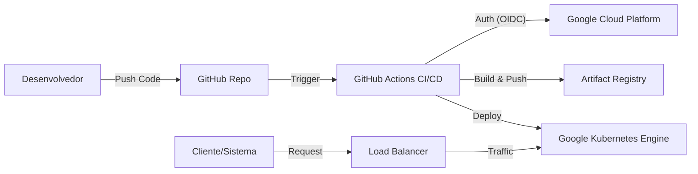

# 🤖 Churn Prediction API: MLOps & Kubernetes Deploy


Este projeto é uma solução **End-to-End de MLOps** para predição de rotatividade de clientes (Churn). Ele vai além da modelagem, entregando uma API de alta performance em **Python/FastAPI**, conteinerizada com **Docker**, orquestrada via **Kubernetes (GKE)** e com deploy 100% automatizado via **GitHub Actions**.

---

## 🏗️ Arquitetura da Solução

O projeto foi desenhado focando em **escalabilidade**, **segurança** e **reprodutibilidade**.



### Destaques da Engenharia:
*   **Separação de Responsabilidades:** Código da API (`app/`) desacoplado dos binários do modelo (`artifacts/`).
*   **Segurança (Zero Key):** Autenticação entre GitHub e Google Cloud feita via **Workload Identity Federation** (sem arquivos JSON de chaves service account).
*   **Alta Disponibilidade:** O modelo roda em réplicas no Kubernetes com Load Balancer gerenciando o tráfego.

---

## 🎯 1. O Problema de Negócio
A rotatividade de clientes (churn) gera perdas significativas. O objetivo deste sistema é fornecer uma API em tempo real para que o CRM da empresa possa consultar a probabilidade de saída de um cliente e tomar ações preventivas.

**Principais Insights do EDA:**
*   Clientes com contratos "mensais" e pagamento via "cheque eletrônico" têm risco crítico.
*   Fatores comportamentais superam os demográficos na predição.

---

## ⚙️ 2. Stack Tecnológica

*   **Linguagem:** Python 3.9
*   **ML Core:** Scikit-learn (Pipeline), LightGBM, Joblib.
*   **API Framework:** FastAPI + Uvicorn + Pydantic (Validação de dados).
*   **Infraestrutura:** Docker, Google Kubernetes Engine (GKE), Artifact Registry.
*   **CI/CD:** GitHub Actions (Build, Push e Deploy automáticos).

---

## 📂 3. Estrutura do Projeto

A organização segue os padrões de microsserviços em Python:

```text
/
├── .github/workflows/   # Pipeline de CI/CD (deploy.yml)
├── app/                 # Código Fonte da Aplicação
│   ├── __init__.py
│   └── main.py          # API FastAPI
├── artifacts/           # Modelos Serializados
│   └── pipeline_lgbm.pkl
├── k8s/                 # Infraestrutura como Código (Kubernetes Manifests)
│   ├── deployment.yaml
│   └── service.yaml
├── Dockerfile           # Instruções de Build Multi-layer
├── requirements.txt     # Dependências fixadas
└── README.md            # Documentação
```

---

## 🧠 4. O Modelo (Machine Learning)

Utilizou-se um **Pipeline do Scikit-learn** para garantir que o pré-processamento de treino seja idêntico ao de produção.

1.  **Pré-processamento:** `ColumnTransformer` com `StandardScaler` (numéricos) e `OneHotEncoder` (categóricos).
2.  **Algoritmo:** **LightGBM** (Gradient Boosting).
3.  **Performance:** ROC AUC de **0.85** (Teste).

---

## 💻 5. Execução Local (Docker)

Para testar a API na sua máquina antes de enviar para a nuvem:

1.  **Clone o repositório:**
    ```bash
    git clone https://github.com/alex3ai/churn-api-gke.git
    cd churn-api-gke
    ```

2.  **Build da Imagem:**
    ```bash
    docker build -t churn-api .
    ```

3.  **Execute o Container:**
    ```bash
    docker run -d -p 8000:8000 --name churn-app churn-api
    ```

4.  **Acesse:**
    *   Documentação Interativa (Swagger): [http://localhost:8000/docs](http://localhost:8000/docs)

---

## 🚀 6. Deploy Contínuo (CI/CD)

Este repositório possui um pipeline configurado em `.github/workflows/deploy.yml`.

**Fluxo de Automação:**
1.  Qualquer **push** na branch `main` dispara o pipeline.
2.  **Login Seguro:** O GitHub se autentica no GCP via OIDC (OpenID Connect).
3.  **Build:** A imagem Docker é criada.
4.  **Push:** A imagem é enviada para o **Google Artifact Registry**.
5.  **Rollout:** O `kubectl` atualiza o deployment no cluster **GKE**, baixando a nova imagem sem downtime.

---

## 🔌 7. Exemplo de Uso da API

**Endpoint:** `POST /predict`

**Payload JSON:**
```json
{
  "Gender": "Female",
  "Senior_Citizen": "No",
  "Partner": "Yes",
  "Dependents": "No",
  "Tenure_Months": 12,
  "Phone_Service": "Yes",
  "Multiple_Lines": "No",
  "Internet_Service": "Fiber optic",
  "Online_Security": "No",
  "Online_Backup": "No",
  "Device_Protection": "No",
  "Tech_Support": "No",
  "Streaming_TV": "Yes",
  "Streaming_Movies": "Yes",
  "Contract": "Month-to-month",
  "Paperless_Billing": "Yes",
  "Payment_Method": "Electronic_check",
  "Monthly_Charges": 89.85,
  "Total_Charges": 1078.20
}
```

**Resposta:**
```json
{
  "predicao": "Sim",
  "probabilidade_de_confianca": "78.45%"
}
```

---

## 👨‍💻 Autor

**Alex Mendes**  
*Machine Learning Engineer | MLOps Enthusiast*  
[LinkedIn](https://www.linkedin.com/in/alex-mendes-80244b292/) | [GitHub](https://github.com/alex3ai)
